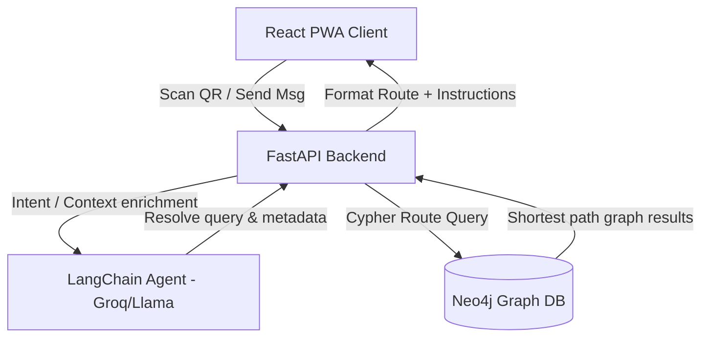

# CampusPilot AI — Core Solution Architecture

**Author:** Dhruv Sarda (Core Solution Architecture Lead)  
**Version:** 1.0 | June 9, 2026

---

## 1. System Components Overview

CampusPilot AI consists of four major layers interacting in real-time to provide context-aware, offline-resilient, and disability-accessible wayfinding:

1. **Vite React PWA Frontend**: Serves as the user interface, incorporating accessibility-compliant viewport settings, QR scanner, interactive SVG map rendering, and a conversation pane.
2. **FastAPI Application Backend**: Orchestrates API requests, translates client profiles/locations, calls the AI agent layer, and Queries the Neo4j database.
3. **LangChain AI Agent (Llama 3.3 70B via Groq)**: Classifies query intents, extracts destinations, detects disability requirements, and runs fallback workflows when routes are unavailable.
4. **Neo4j Graph Database**: Stores the digital twin of the campus layout (rooms, halls, corridors, entrances, stairs, lifts, and QR points).

---

## 2. Graph Database Modeling

We represent campus infrastructure as a mathematical graph $G = (V, E)$, enabling efficient multi-constraint pathfinding queries.

### Nodes ($V$)
- `QRPoint`: Physical QR codes serving as offline positioning landmarks.
- `Room`: Classrooms, offices, laboratories, auditoriums.
- `Corridor`: Junctions and segments linking campus nodes.
- `Lift` / `Stairs`: Vertical transition shafts.
- `Entrance`: Entry gates connecting outdoor routes to indoor structures.

### Relationships ($E$)
- `CONNECTS_TO`: Direct walking pathways with properties:
  - `distance_meters` (float)
  - `wheelchair_accessible` (boolean)
  - `tactile_paving` (boolean)
  - `stairs` (boolean)
  - `lift` (boolean)

---

## 3. End-to-End Navigation Flow

The path calculation runs as follows:
1. The user scans a QR code at their starting location, which sets the starting `QRPoint` node.
2. The user types a request (e.g., "Take me to Seminar Hall 101").
3. The FastAPI router parses the input, queries the intent classifier, resolves the destination room name from the text query, and determines the start node from the QR code.
4. The backend queries Neo4j using Cypher pathfinding filtered by the user's disability profile constraints.
5. The computed node path and edges are formatted into directional instructions and displayed to the user.
