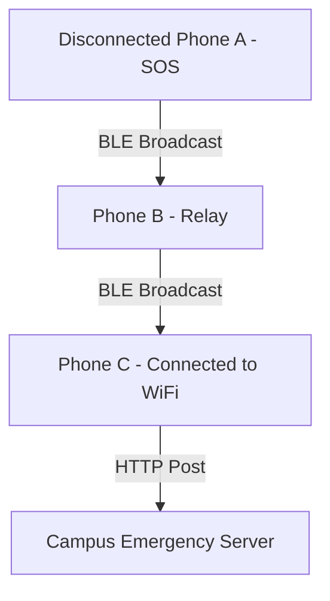

# Bluetooth Mesh Network Design Spec

**Author:** Dhruv Sarda (Core Solution Architecture Lead)  
**Version:** 1.0 | June 9, 2026

---

## 1. Context and Problem Statement
During major campus events or emergency situations, network infrastructure (WiFi, cellular) is prone to saturation or failure. Navigation assistants must operate offline to route users and broadcast SOS signals in dangerous scenarios.

## 2. Bluetooth Mesh Architecture
Using **Google Nearby Connections API** (or Apple Multipeer Connectivity), we implement a decentralized Bluetooth Mesh Network. When a device loses internet connectivity, it automatically starts advertising its presence and scanning for nearby peers.

## 3. Data Packets and Routing
Peers exchange compact protocol packets:
- **`SOS Packet`**: `{sender_id, timestamp, last_known_qr, profile_details, message}`
- **`Data Sync Packet`**: `{map_version, active_obstructions}`

Packets are propagated using a flooding protocol with a Time-to-Live (TTL) limit of 5 hops to prevent network congestion. When a mesh node with active internet connectivity receives an SOS packet, it automatically bridges and posts it to the central campus emergency API.
