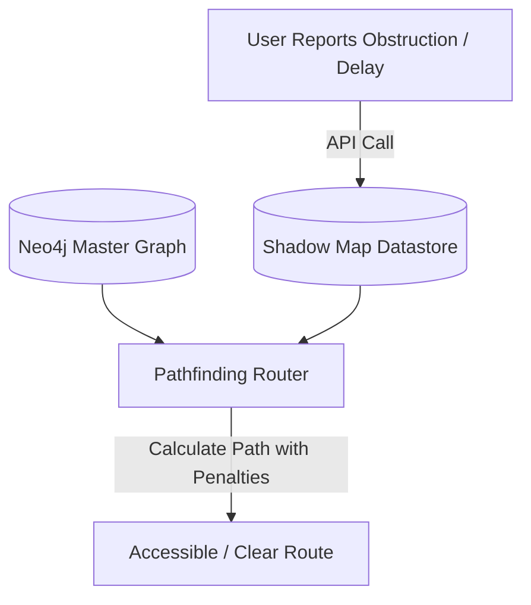

# Shadow Map Design Spec

**Author:** Dhruv Sarda (Core Solution Architecture Lead)  
**Version:** 1.0 | June 9, 2026

---

## 1. What is a Shadow Map?

Traditional indoor mapping is static. When a lift breaks down or a corridor is blocked for maintenance, the system continues to route users through them. 

The **Shadow Map** is a dynamic graph overlay layer. It does not modify the master Neo4j database schema directly. Instead, it maintains a temporary overlay of active exceptions, obstructions, and user-reported telemetry. When calculating a path, the backend joins the master campus graph with the shadow map data, applying real-time traversal penalties or blocks.

## 2. Telemetry and Feedback Loop

1. **Passive Telemetry**: The client app measures the time taken to traverse between two physical QR checkpoints. If the average traversal duration increases by 150%, a temporary bottleneck penalty is added to the connection segment.
2. **Active Reporting**: Users can flag obstacles (e.g., "water spill in corridor A", "lift A out of service"). If three independent users flag an issue within a 2-hour window, the segment is penalized or disabled.

## 3. Data Structure

The Shadow Map stores entries in a Redis or in-memory key-value database for fast lookups:
- `key`: `relationship_id` / `source_node_id:target_node_id`
- `value`:
  - `status`: `BLOCKED` | `DELAYED` | `NORMAL`
  - `penalty_multiplier`: Float (e.g., 2.5 means distance feels 2.5x longer)
  - `details`: String description (e.g., "Elevator maintenance")
  - `expires_at`: Timestamp
